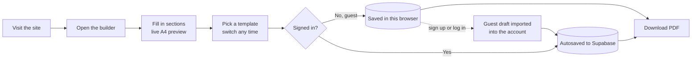
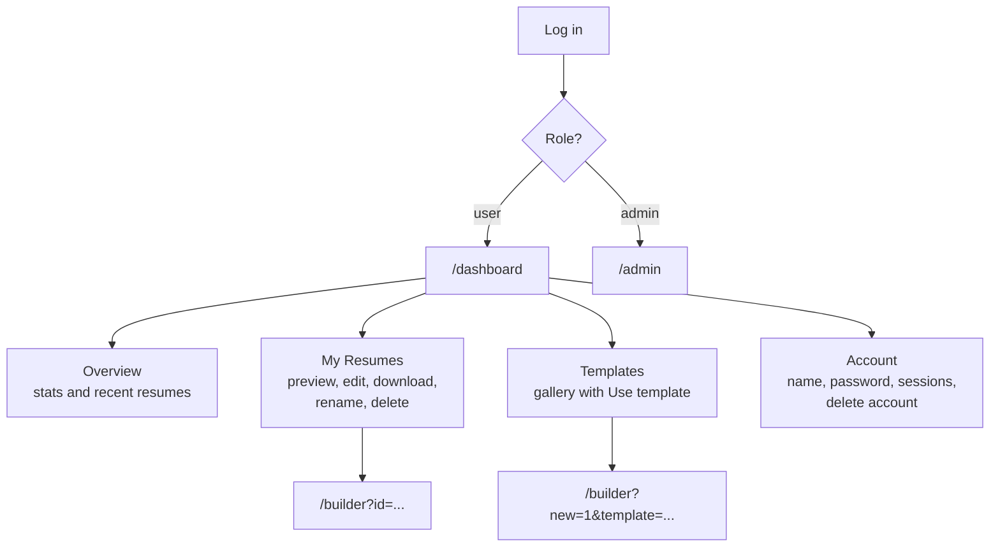
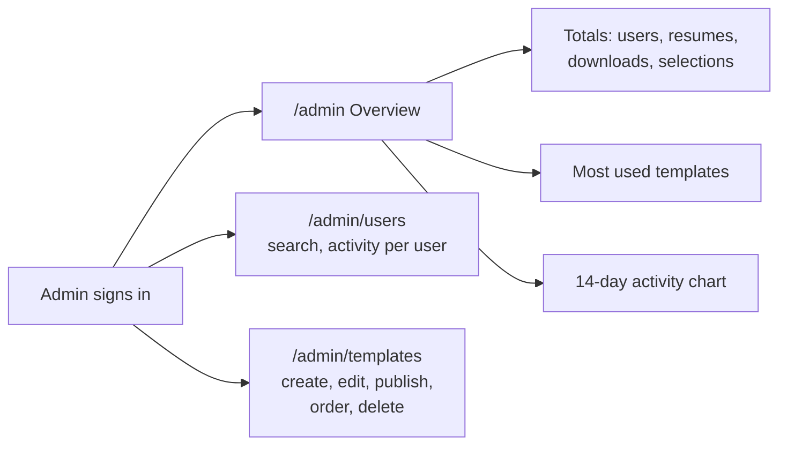
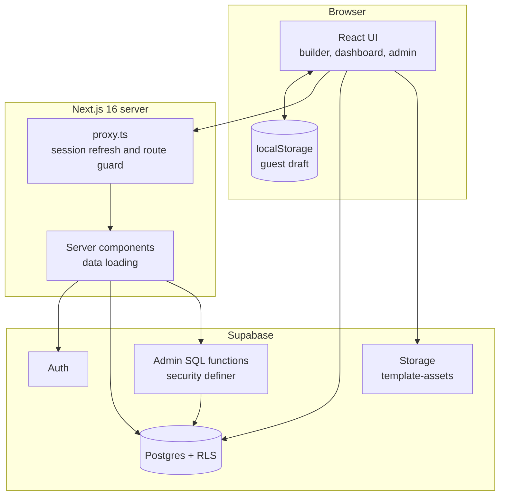
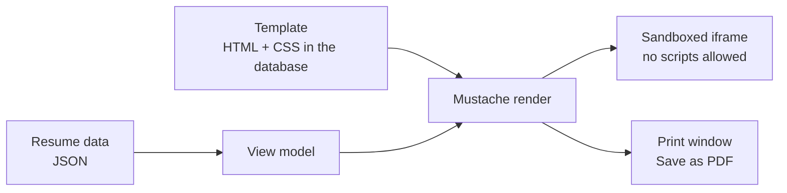

<div align="center">

# Resonance

### Create a resume that represents your work.

A guest-first resume builder with a live A4 preview, ten professionally designed templates, one-click PDF export, and a full admin panel for usage analytics.

<br />


<br />

[Highlights](#-highlights) ·
[How it works](#-how-it-works) ·
[Tech stack](#-tech-stack) ·
[Architecture](#-architecture) ·
[Getting started](#-getting-started) ·
[Project structure](#-project-structure)

</div>

---

## ✦ Highlights

| | |
|---|---|
| **Guest-first** | Start building instantly with no account. The draft lives on the device and moves into the account automatically on sign-up. |
| **Live A4 preview** | Every keystroke renders in a paper-sized preview, in the template you picked. Switch templates any time without retyping. |
| **10 templates** | Classic, Modern, Minimal, Executive, Creative, Academic, Compact, Elegant, Two-Column and an ATS-friendly plain layout. |
| **Smart autosave** | Debounced saves with a clear status. Empty drafts are never written to your account. |
| **Completeness score** | A weighted progress bar that shows how finished the resume is. |
| **One-click PDF** | Download from the builder, the resume list, or the preview dialog. All use the same export path. |
| **User dashboard** | Overview, My Resumes (preview, edit, download, rename, delete), a templates gallery, and account settings. |
| **Account security** | Change password with current-password check, sign out of all devices, and self-service account deletion. |
| **Admin panel** | Registered users, template usage, downloads, daily activity and most-used templates. Plus full template management. |
| **Secure by design** | Row Level Security on every table, column-level grants, sanitised templates and sandboxed previews. |

---

## ✦ How it works

### The user journey



1. **Start as a guest.** Open `/builder` and begin typing. Nothing to sign up for.
2. **Build.** Work through Personal, Summary, Experience, Education, Skills, Projects, Certifications and Languages while the preview updates live.
3. **Choose a template.** Ten layouts, switchable at any time. Your content never changes, only the design.
4. **Download.** The PDF opens through the browser's print dialog, named after you (for example `jane-doe-resume.pdf`).
5. **Sign in to keep it.** A guest resume is offered for import when you sign in, so nothing is lost.

### The signed-in dashboard



- **New resumes start as drafts.** "Create New Resume" and "Use template" open a blank draft. A row is only written to the database once there is real content.
- **Existing resumes open by id.** Preview, edit, rename, download and delete all work from the My Resumes list.

### The admin flow



Admins land in their own panel and are redirected away from the user dashboard. Analytics are aggregated by database functions, so admins see counts and activity but never the contents of anyone's resume.

### Routes at a glance

| Area | Route | Access |
|---|---|---|
| Marketing | `/`, `/features`, `/templates`, `/about`, `/faq`, `/contact`, `/blog`, `/privacy`, `/terms` | Public |
| Builder | `/builder` | Public (guest or signed in) |
| Auth | `/auth/login`, `/auth/signup`, `/auth/signout` | Public |
| Dashboard | `/dashboard`, `/dashboard/resumes`, `/dashboard/templates`, `/dashboard/account` | Signed-in users |
| Admin | `/admin`, `/admin/users`, `/admin/templates` (+ `new`, `[id]`) | Admins only |

---

## ✦ Tech stack

| Layer | Technology | Used for |
|---|---|---|
| **Framework** | [Next.js 16](https://nextjs.org) (App Router) | Server components, route protection via `proxy.ts`, server-side data loading |
| **UI library** | [React 19](https://react.dev) | Interactive builder, dashboard and admin screens |
| **Language** | [TypeScript 5](https://www.typescriptlang.org) | End-to-end typing, including generated Supabase types |
| **Styling** | [Tailwind CSS 4](https://tailwindcss.com) | Design tokens (cream, olive, charcoal), themed scrollbars |
| **Typography** | Inter + Playfair Display via `next/font` | Clean sans body, editorial serif headings |
| **Icons** | [lucide-react](https://lucide.dev) | Interface icons |
| **Backend** | [Supabase](https://supabase.com) | Postgres database, Auth, Storage, Row Level Security |
| **Supabase clients** | `@supabase/ssr`, `@supabase/supabase-js` | Cookie-based sessions on server and browser |
| **Templating** | [Mustache](https://github.com/janl/mustache.js) | Logic-less resume templates, HTML-escaped by default |
| **Sanitising** | `sanitize-html` | Cleans admin-authored template markup |
| **PDF export** | Browser print pipeline | Paper-accurate PDFs with no server rendering cost |
| **Tooling** | ESLint 9, `eslint-config-next` | Linting |
| **Hosting** | [Vercel](https://vercel.com) (recommended) | Deployment |

---

## ✦ Architecture



### Template rendering pipeline



Resume text is always HTML-escaped. Templates may not use unescaped tags, custom delimiters or partials, and previews run in an iframe with scripts disabled, so neither a template nor a resume can inject executable code.

### Data model

| Table | Purpose |
|---|---|
| `profiles` | One row per user: name, email, `role` (`user` or `admin`) |
| `resumes` | Each saved resume as JSON, owned by a user |
| `templates` | Published and draft templates (HTML, CSS, category, sort order) |
| `template_events` | `selected` and `downloaded` events that power admin analytics (guests are `null`) |
| `feedback` | Messages from the contact and report forms |
| `storage: template-assets` | Public-read bucket for template thumbnails and assets, admin-write |

### Security model

- **Row Level Security everywhere.** Users can only read and write their own resumes and profile.
- **No self-promotion.** Signed-in users may only update `profiles.full_name`, so nobody can grant themselves admin.
- **Private resume content.** Admin analytics run through `SECURITY DEFINER` functions that return counts only and refuse non-admins.
- **Guarded routes.** `proxy.ts` blocks `/dashboard` and `/admin` when signed out, and server layouts re-check the role.
- **Safe deletion.** `delete_my_account()` removes only the caller, refuses admins, and anonymises (not deletes) analytics history.

---

## ✦ Getting started

### Prerequisites

- Node.js **20.9 or newer**
- A free [Supabase](https://supabase.com) project

### 1. Install

```bash
git clone <your-repo-url>
cd AiResume-Builder-main
npm install
```

### 2. Configure environment

Create `.env.local` in the project root:

```bash
NEXT_PUBLIC_SUPABASE_URL=https://YOUR-PROJECT.supabase.co
NEXT_PUBLIC_SUPABASE_ANON_KEY=your-anon-key

# Optional: canonical URL for SEO, sitemap and metadata.
# Falls back to the Vercel URL, then localhost.
NEXT_PUBLIC_SITE_URL=https://your-domain.com
```

Both Supabase values are in **Project Settings → API**. Only the public anon key is used; there is no service-role key in this app.

### 3. Set up the database

Open the Supabase **SQL editor** and run the migrations **in order**:

| # | File | Adds |
|---|---|---|
| 1 | `0001_profiles_and_rls.sql` | Profiles, signup trigger, RLS |
| 2 | `0002_feedback_and_rls.sql` | Feedback table |
| 3 | `0003_resumes_and_rls.sql` | Resumes table and policies |
| 4 | `0004_templates_events_admin.sql` | Templates, usage events, admin role, storage bucket |
| 5 | `0005_launch_templates.sql` | Seeds the 10 launch templates |
| 6 | `0006_admin_analytics.sql` | Admin analytics functions |
| 7 | `0007_delete_account.sql` | Self-service account deletion |

Optional checks live in `supabase/verification/`, and `supabase/cleanup_empty_resumes.sql` removes blank resumes saved by older versions.

### 4. Make yourself an admin

Sign up through the app first, then run:

```sql
update public.profiles set role = 'admin' where email = 'you@example.com';
```

### 5. Run

```bash
npm run dev
```

Open [http://localhost:3000](http://localhost:3000).

### Scripts

| Command | What it does |
|---|---|
| `npm run dev` | Start the development server |
| `npm run build` | Create a production build |
| `npm run start` | Serve the production build |
| `npm run lint` | Run ESLint |
| `npm run templates:generate` | Regenerate `0005_launch_templates.sql` from `supabase/templates/` |

### Deploying to Vercel

1. Import the repository into Vercel.
2. Add the environment variables above.
3. Deploy. In Supabase, add your production URL under **Authentication → URL Configuration**.

---

## ✦ Project structure

<details>
<summary><strong>Open the folder map</strong></summary>

```text
.
├── app/
│   ├── (public)/            Marketing pages: home, features, templates, faq, blog…
│   ├── auth/                login, signup, signout
│   ├── builder/             The resume builder
│   ├── dashboard/           User area: overview, resumes, templates, account
│   ├── admin/               Admin panel: overview, users, templates
│   └── globals.css          Design tokens and themed scrollbars
├── components/
│   ├── account/             Profile, password and account-action forms
│   ├── admin/               Admin shell and template form
│   ├── dashboard/           Dashboard shell, resume list, preview dialog, icon actions
│   ├── resume/
│   │   ├── builder/         Context, autosave, header, download, template picker
│   │   ├── forms/           One form per resume section
│   │   └── preview/         Live A4 preview
│   ├── templates/           Template frame and gallery
│   ├── public/              Header, footer, hero preview, CTA
│   └── ui/                  Button, dialog, input, card, badge
├── lib/
│   ├── supabase/            Browser and server clients
│   ├── resume/              Persistence adapters, PDF, completeness, guest import
│   ├── templates/           Render, sanitise, view model, gallery loader
│   ├── auth/                Shared auth helpers and session role lookup
│   └── admin/               Admin guard
├── supabase/
│   ├── migrations/          0001 to 0007, run in order
│   ├── templates/           Source HTML and CSS for the 10 templates
│   └── verification/        RLS verification queries
├── scripts/                 Template seed generator
├── types/                   Resume and Supabase types
└── proxy.ts                 Session refresh and route protection
```

</details>

---

## ✦ Design notes

- **Persistence adapters.** The builder talks to one interface with two implementations: guest (localStorage) and authenticated (Supabase). The UI never needs to know which is active.
- **Never save nothing.** A signed-in resume is only written once it has content or a custom title. Opening the builder and leaving leaves no trace.
- **One download path.** A single hook powers every download button, so analytics and behaviour stay identical everywhere.
- **Themed throughout.** A cream, olive and charcoal palette is defined as design tokens and applied consistently, down to the scrollbars.

---

<div align="center">

Built with Next.js, React and Supabase.

</div>